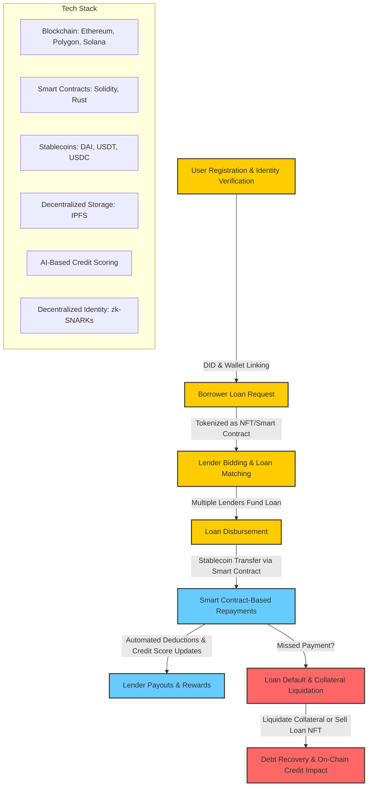

```mermaid
graph TD;
    A[User Registration & Identity Verification] -->|DID & Wallet Linking| B[Borrower Loan Request]
    B -->|Tokenized as NFT/Smart Contract| C[Lender Bidding & Loan Matching]
    C -->|Multiple Lenders Fund Loan| D[Loan Disbursement]
    D -->|Stablecoin Transfer via Smart Contract| E[Smart Contract-Based Repayments]
    E -->|Automated Deductions & Credit Score Updates| F[Lender Payouts & Rewards]
    E -->|Missed Payment?| G[Loan Default & Collateral Liquidation]
    G -->|Liquidate Collateral or Sell Loan NFT| H[Debt Recovery & On-Chain Credit Impact]
    
    subgraph Tech Stack
        T1[Blockchain: Ethereum, Polygon, Solana]
        T2[Smart Contracts: Solidity, Rust]
        T3[Stablecoins: DAI, USDT, USDC]
        T4[Decentralized Storage: IPFS]
        T5[AI-Based Credit Scoring]
        T6[Decentralized Identity: zk-SNARKs]
    end
    
    style A fill:#ffcc00,stroke:#333,stroke-width:2px;
    style B fill:#ffcc00,stroke:#333,stroke-width:2px;
    style C fill:#ffcc00,stroke:#333,stroke-width:2px;
    style D fill:#ffcc00,stroke:#333,stroke-width:2px;
    style E fill:#66ccff,stroke:#333,stroke-width:2px;
    style F fill:#66ccff,stroke:#333,stroke-width:2px;
    style G fill:#ff6666,stroke:#333,stroke-width:2px;
    style H fill:#ff6666,stroke:#333,stroke-width:2px;

```